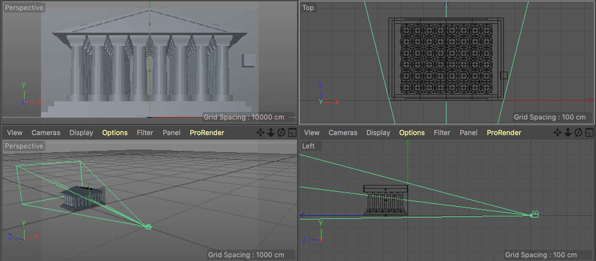
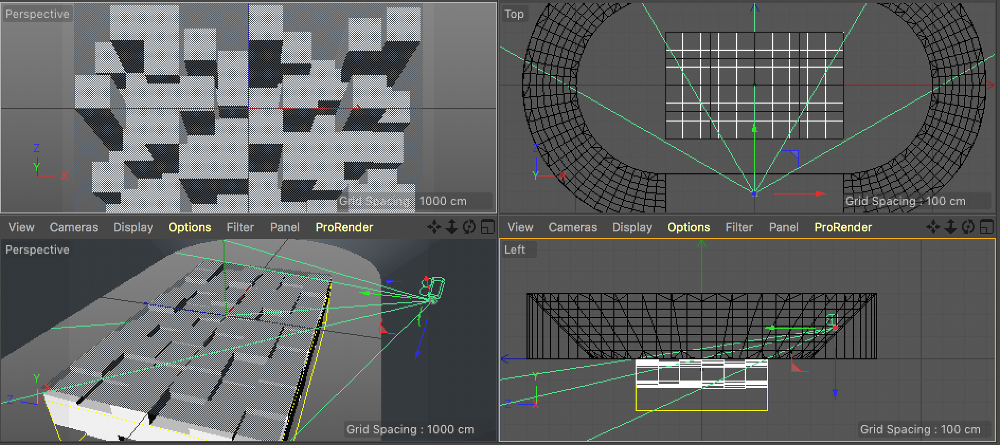

# AeroplaneC4D

#### Asymmetric Camera for Cinema 4D

Shifts a camera's frustum to a target plane. Really useful for [video mapping](https://www.youtube.com/watch?v=vHF9HQTO_9Y), to render a scene from the audience's perspective.

Created on Cinema 4D R19 macOS, but since it's Python should run on any platform and be fairly back and forward compatible.

## Usage	

* Download the latest [release](https://github.com/rsodre/AeroplaneC4D/releases).
* Copy the Aeroplane folder to your Cinema 4D plugins folder.
* Create a **Plane Object** with the **exact same aspect** as your render settings frame size. (if you don't know how to calculate the aspect, make the plane the same size as your frame size).
* Move an scale the plane to cover your render area. This will be the *window* your camera will render into.
* Add the **Aeroplane** tag to your camera.
* Drop the plane object into the **Target Plane** attibute.
* You can enable/disable it from the tag.
* When enabled, the plugin will create a Constaint tag to lock the camera axis to the plane, please don't delete it.
* Don't get it? Open the examples at `Aeroplane/Examples`

## Examples	

### Example 1

Audience POV is on the ground, projection on a building.

### Example 2

Audience POV is on the bleachers of a stadium, projection on the field.

